# 基于多子系统协同的家庭服务机器人系统

## 一、问题定义

### 1、软件名称及性质

**软件名称**：家庭服务机器人系统（Family Robot）

**软件性质**：本项目是一个集远程操控、AI 语音助手、嵌入式运动控制与数据管理于一体的家庭服务机器人综合系统。系统由四个子系统协同工作：树莓派实时运行时（Python）、Web 前端控制面板（Vue 3 + TypeScript）、Java Spring Boot 数据后端、以及 STM32 嵌入式运动控制固件（C + FreeRTOS）。

### 2、软件背景

随着物联网（IoT）和人工智能技术的快速发展，智能家居已从简单的设备联动升级为具备感知、决策与执行能力的综合服务系统。家庭服务机器人作为智能家居的核心载体，需要具备以下能力：远程实时操控、自然语言交互、环境感知（视频监控）、以及个性化的日程管理与提醒服务。

然而，当前市场上的家庭机器人产品普遍存在以下不足：功能分散于多个独立设备，缺乏统一协同平台；AI 对话与物理操控割裂，用户需要在不同界面之间切换；开源可定制的机器人系统稀缺，二次开发门槛高。

本项目旨在构建一个从底层硬件到上层应用全栈打通的家庭服务机器人系统，填补"可定制、全功能、软硬件一体"家庭机器人平台的市场空白。

### 3、现状及存在问题

当前家庭服务机器人领域存在以下问题：

（1）**功能碎片化**：远程操控、视频监控、语音助手、日程提醒等功能分散在不同设备和应用中，缺乏统一的操作入口和协同机制；

（2）**AI 与硬件脱节**：多数 AI 语音助手仅能提供信息查询，无法控制物理设备（如机器人移动、云台转动等），用户需要手动切换控制方式；

（3）**实时性不足**：视频监控和控制指令的传输存在较大延迟，影响远程操控体验；

（4）**数据管理缺失**：缺乏用户认证、操作日志、相册管理等持久化数据功能，无法实现个性化服务；

（5）**定制化难度高**：商用机器人系统封闭，开发者难以根据实际需求进行功能扩展和系统定制。

### 4、需要改进的具体方面或需求

（1）**统一操控平台**：通过 Web 前端提供机器人移动控制、云台摄像头调节、速度切换等完整的远程操控功能；

（2）**AI 自然交互**：集成大语言模型实现自然语言对话，AI 能够理解用户意图并直接控制机器人执行相应动作；

（3）**视频实时监控**：通过 MJPEG 视频流和 WebRTC 语音通话实现远程实时监控和双向沟通；

（4）**智能提醒系统**：支持邮件和语音两种提醒方式，AI 可通过对话自动创建提醒；

（5）**数据持久化**：提供用户认证（JWT）、操作日志、相册管理、设备设置等完整的数据管理功能；

（6）**多端协同**：Web 端与机器人端通过 WebSocket 实时通信，确保控制指令的即时送达与状态回传。

### 5、本项目能带来的经济/社会效益、应用前景

**经济效益**：
- 降低家庭安防成本：一套系统同时实现远程监控、语音交互和智能提醒，替代多种独立设备
- 开源可定制：基于开源技术栈构建，降低二次开发成本，个人开发者和小型企业均可部署
- 模块化架构：各子系统可独立部署和扩展，支持按需配置降本增效

**社会效益**：
- 辅助居家养老：远程操控 + AI 语音交互 + 视频监控，为独居老人提供远程陪伴和安全监护
- 儿童陪伴教育：AI 语音助手可进行知识问答和语言学习，机器人运动控制增加互动趣味性
- 技术教育价值：全栈开源项目可作为嵌入式、Web 开发、AI 集成等领域的教学案例

**应用前景**：
作为模块化的家庭服务平台，未来可扩展至以下场景：
- 结合计算机视觉实现自动巡逻与异常检测
- 结合 SLAM 技术实现自主导航与建图
- 对接智能家居平台（HomeAssistant 等）实现设备联动
- 多机器人协同编队与任务分配

### 6、特色或优势

（1）**四子系统协同架构**：树莓派实时运行时 + Web 前端 + Java 后端 + STM32 嵌入式，形成完整的技术闭环，从底层硬件到上层应用全链路打通；

（2）**AI 深度集成**：大语言模型（Kimi K2.5）不仅用于对话，还能通过 function calling 直接控制机器人运动、设置提醒，实现"说话即操控"的自然交互体验；

（3）**双协议实时通信**：WebSocket 保证控制指令毫秒级送达，WebRTC 实现低延迟语音通话，MJPEG 流式传输摄像头画面；

（4）**完整的用户体系**：JWT 认证、角色权限管理（管理员/普通用户）、验证码登录/注册/密码重置、操作日志审计；

（5）**意图识别增强**：关键词预过滤 + 强制 tool_choice 的方案，确保常见操控指令（如"前进""停下"）能被即时拦截并直接执行，不经过 AI 调用，降低延迟提高准确率。

---

## 二、可行性分析

### 1、技术可行性

本系统采用成熟的业界主流技术栈，所有技术组件均经过大规模生产验证：

**树莓派运行时（Python 3）**：
- FastAPI 异步 Web 框架提供低延迟的 WebSocket 和 HTTP 服务
- aiortc 库实现 WebRTC 实时语音通话
- openWakeWord + Whisper.cpp + Piper TTS 组成完整的语音交互流水线
- Picamera2 提供硬件加速的摄像头图像采集
- httpx 异步 HTTP 客户端实现与 Java 后端的服务间调用

**Web 前端（Vue 3 + TypeScript + Vite）**：
- Vue 3 Composition API 实现响应式 UI，Pinia 进行状态管理
- Tailwind CSS v4 提供高效的原子化样式方案
- 原生 WebSocket API + WebRTC API，无需额外重型依赖
- Vite 构建工具提供极速开发体验

**Java 数据后端（Spring Boot 3）**：
- Spring Security + JWT 提供无状态认证与授权
- Spring Data JPA + Hibernate 实现 ORM 映射与数据库操作
- Spring Scheduling 实现定时任务（提醒发送、日志清理）
- MySQL 8.0 作为关系型数据库
- Java Mail Sender 集成 QQ SMTP 邮件服务

**STM32 嵌入式固件（C + FreeRTOS）**：
- STM32F407 主控，168MHz 主频
- TIM1 4 通道 PWM 驱动两路直流电机（H 桥）
- TIM13 软件 PWM 驱动两路舵机（云台）
- TIM2/TIM5 编码器模式进行速度测量
- USART1 115200 波特率与上位机通信

以上技术栈均为业界标准且有完善社区支持，技术可行性充分。

### 2、经济可行性

（1）**硬件成本**：
- 树莓派 4B：约 300-400 元
- STM32F407 开发板：约 80-150 元
- 摄像头模块（IMX219）：约 50-80 元
- USB 麦克风 + 音箱：约 60-100 元
- 直流电机 + 驱动板 + 舵机 + 底盘：约 100-200 元
- **硬件总成本**：约 590-930 元

（2）**软件成本**：
- 所有软件依赖均为开源免费（Python、Vue、Spring Boot、FreeRTOS 等）
- 大语言模型 API（Kimi K2.5）按量计费，单次对话约 0.01-0.05 元
- 邮件服务使用 QQ SMTP 免费额度（每日 500 封）
- MySQL Community Edition 免费

（3）**部署成本**：
- 树莓派本地部署，无需云服务器
- PC 端运行 Java 后端 + Web 前端，局域网内使用无需公网 IP
- 总运营成本极低，适合个人和家庭使用

### 3、操作可行性

（1）**Web 控制面板**：
- 直观的方向键控制界面（D-Pad），支持键盘快捷键和触屏操作
- 实时视频画面监控，连接状态、电量、信号强度一目了然
- AI 对话界面简洁友好，支持多轮对话记录
- 相册管理与提醒管理提供标准 CRUD 操作界面
- 响应式布局适配不同屏幕尺寸

（2）**语音交互**：
- 唤醒词触发（openWakeWord），无需手动操作
- 语音识别（Whisper）支持中英文
- 语音合成（Piper TTS）提供自然流畅的语音反馈

（3）**管理后台**：
- 管理员可查看/搜索用户、查看密码、删除用户
- 管理员可注册机器人序列号、查看绑定状态、管理设备

### 4、社会与法律可行性

（1）**合规性保障**：
- 用户密码采用 bcrypt 加密存储，不使用明文
- JWT 令牌实现无状态认证，不存储会话信息
- 邮件验证码有 5 分钟有效期和一次性使用限制
- 管理员查看用户密码需单独请求，系统记录操作日志

（2）**隐私保护**：
- 视频数据仅在局域网内传输，不上传云端
- 照片存储于本地，用户可随时删除
- AI 对话记录存储于内存中，会话结束即销毁

（3）**开源协议**：
- 项目采用私有仓库管理，所有依赖均为开源兼容协议
- 可考虑未来以 MIT 或 Apache 2.0 协议开源

---

## 三、需求分析

### 1、系统功能性需求和非功能性需求

#### 1.1 功能性需求

##### 1.1.1 用户认证相关功能

（1）**密码登录**：用户通过邮箱和密码登录系统，后端验证后返回 JWT 令牌；
（2）**验证码登录**：用户输入邮箱获取 6 位验证码，验证通过后返回 JWT 令牌；
（3）**注册**：用户提交邮箱、密码和机器人序列号，通过邮件验证码验证身份后完成注册并绑定机器人；
（4）**密码重置**：用户通过邮箱验证码重置密码；
（5）**个人信息查看**：登录后可查看姓名、邮箱、角色、最后登录时间等信息；
（6）**退出登录**：清除令牌，通知后端销毁 AI 会话。

##### 1.1.2 机器人控制相关功能

（1）**移动控制**：支持前进/后退/左转/右转/停止五种基本运动指令，可通过键盘方向键或屏幕方向键控制；
（2）**云台控制**：支持水平（servo1）和垂直（servo2）两个舵机的角度调节，通过 WASD 键或屏幕按钮控制；
（3）**速度调节**：支持低/中/高三档速度切换；
（4）**实时状态显示**：显示连接状态、电量百分比、信号强度等信息；
（5）**操作日志记录**：所有控制指令记录到 MySQL 数据库，包含指令名、来源（web/voice/auto）和时间戳。

##### 1.1.3 AI 对话相关功能

（1）**自然语言对话**：用户通过 Web 界面与 Jarvis AI 助手进行多轮对话；
（2）**机器人控制**：AI 理解用户的运动指令（如"前进""停下"）并控制机器人执行；
（3）**提醒设置**：AI 理解用户的提醒需求（如"5分钟后提醒我开会"）并自动创建提醒；
（4）**会话管理**：每个用户维护独立的对话上下文（最多 50 轮），会话结束时销毁；
（5）**意图预过滤**：常见操控指令直接拦截执行，跳过 AI 调用，降低响应延迟。

##### 1.1.4 视频与语音相关功能

（1）**MJPEG 实时视频流**：浏览器通过 HTTP 流式接收并显示机器人摄像头的实时画面；
（2）**WebRTC 语音通话**：浏览器与机器人之间建立实时语音通话，支持音频双向传输；
（3）**拍照功能**：控制机器人拍照并自动保存到相册。

##### 1.1.5 提醒相关功能

（1）**创建提醒**：用户可手动设置提醒内容、时间、方式（邮件/语音）和邮箱地址；
（2）**编辑提醒**：可修改提醒内容、时间、方式和启用状态；
（3）**删除提醒**：支持删除不需要的提醒；
（4）**启用/禁用切换**：一键开关单个提醒；
（5）**自动发送**：Java 后端每分钟扫描到期提醒，通过邮件或调用 Python 内部接口通过机器人语音播报；
（6）**AI 创建提醒**：通过 AI 对话自然语言创建提醒；
（7）**中文语音翻译**：中文语音提醒在存储时自动翻译为英文，确保 TTS 播报质量。

##### 1.1.6 相册管理相关功能

（1）**照片查看**：网格展示所有照片，显示拍摄日期；
（2）**批量下载**：支持多选批量下载照片；
（3）**批量删除**：支持多选批量删除照片；
（4）**照片上传**：支持手动添加照片 URL。

##### 1.1.7 管理员相关功能

（1）**用户管理**：查看所有注册用户（不含管理员账户），支持按姓名/邮箱/机器人序列号搜索；
（2）**密码查看**：管理员可查看用户密码明文（点击眼睛图标后请求后端解密）；
（3）**用户删除**：管理员可删除用户及其所有关联数据（机器人、照片、操作日志、设置、提醒、验证码）；
（4）**机器人管理**：注册新机器人序列号，查看机器人列表（支持搜索/排序/日期筛选）；
（5）**机器人删除**：删除机器人，如已绑定用户则级联删除用户及其数据。

#### 1.2 性能需求

（1）**并发能力**：WebSocket 支持 Web 端和 Pi 端各 1 个长连接，满足家庭场景使用需求；
（2）**响应时间**：控制指令从 Web 到 Pi 的单向延迟 ≤ 100ms（局域网环境）；
（3）**视频延迟**：MJPEG 视频流延迟 ≤ 500ms；
（4）**AI 回复**：大语言模型 API 调用响应时间 ≤ 5s（不含预过滤指令，预过滤指令 ≤ 50ms）；
（5）**定时任务**：提醒扫描每分钟执行一次，确保准时送达。

#### 1.3 可靠性和可用性需求

（1）**可靠性**：
- WebSocket 连接断开后自动重连（最多 5 次，1.5 秒间隔）；
- 30 秒心跳机制保持 WebSocket 长连接；
- Java 后端异常时不影响实时操控（WebSocket 直连 Pi 端）。

（2）**可用性**：
- 树莓派运行时支持 `--mode all|voice|remote` 按需启动不同功能组合；
- 树莓派启动后自动恢复与 Python Backend 的 WebSocket 连接；
- 前端 JWT 过期自动跳转登录页。

#### 1.4 出错处理需求

（1）**前端异常处理**：
- API 调用返回 401 时自动清除令牌并跳转登录页；
- WebSocket 断连自动重连，状态栏实时显示连接状态；
- AI 调用失败时向用户展示友好的错误提示。

（2）**后端异常处理**：
- 业务异常返回对应 HTTP 状态码（400/401/403/404）和错误消息；
- 定时任务异常仅记录日志，不影响后续执行；
- 提醒发送失败不影响其他提醒的发送。

（3）**日志体系**：
- Java 后端使用 SLF4J + Logback 记录操作日志；
- Python 后端使用 logging 模块记录 WebSocket 和 AI 交互日志；
- STM32 通过 USART1 串口输出调试信息。

#### 1.5 接口需求

（1）**外部接口**：
- Kimi K2.5 Moonshot API：提供大语言模型对话和 function calling 能力；
- QQ SMTP 邮件服务：发送注册验证码和邮件提醒；
- Google STUN 服务器：WebRTC NAT 穿透。

（2）**内部接口**：
- Java REST API：23 个 RESTful 接口，覆盖认证、用户、相册、提醒、设置、管理等功能；
- Python FastAPI REST：4 个 HTTP 接口 + 1 个 WebSocket 端点；
- Python 内部接口：`POST /internal/voice-reminder` 供 Java 后端调用以触发语音提醒；
- 树莓派 UART 串口协议：`S1=90`（舵机角度）、`M1=500`/`M2=-300`（电机速度）。

#### 1.6 约束条件

（1）**运行环境**：
- 树莓派：Python 3.13，Linux 系统（Raspberry Pi OS），需安装 Picamera2、Whisper.cpp、Piper TTS；
- PC 端：Java 17+、Node.js 18+、MySQL 8.0；
- 浏览器：Chrome/Firefox/Edge 最新版本，支持 WebSocket 和 WebRTC。

（2）**网络要求**：
- 树莓派与 PC 在同一局域网内；
- 树莓派需能访问互联网（调用 Kimi API 和邮件服务）。

（3）**硬件要求**：
- 树莓派 4B（2GB+ RAM）
- STM32F407VET6 开发板
- IMX219 摄像头模块
- USB 全向麦克风 + 3.5mm 音频输出

### 2、数据流图

# 2.1 顶层数据流图

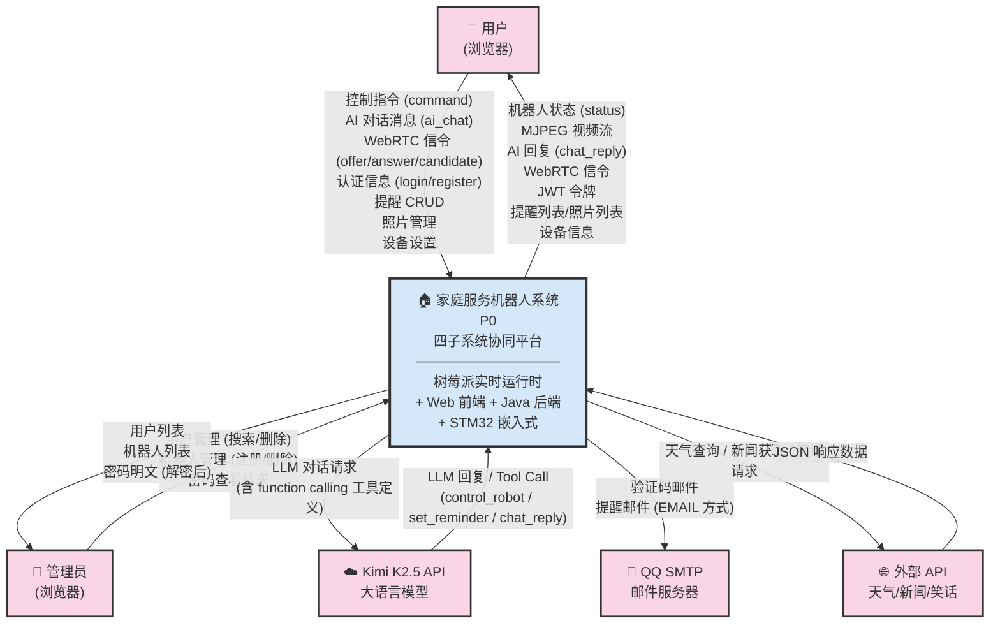

**图 2.1 顶层数据流图（DFD Level 0）**

> **说明**：顶层数据流图将整个家庭服务机器人系统抽象为一个核心处理节点 P0，展示其与所有外部实体之间的数据交互。外部实体包括两类角色（用户、管理员）和三组外部服务（Kimi K2.5 LLM、QQ SMTP 邮件服务器、天气/新闻/笑话 API）。数据流（箭头）标注了实际系统代码中传输的消息类型和数据结构。

#### 2.2 实时控制数据流

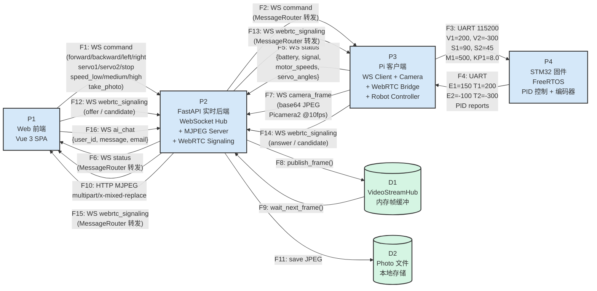

**图 2.2 实时控制数据流图（DFD Level 1 — 实时层）**

> **说明**：本图聚焦于系统的实时控制层数据流，展示了四条核心路径：
> 1. **控制下发链**（F1→F2→F3）：浏览器 → FastAPI → Pi → STM32 的指令传递
> 2. **状态回传链**（F4→F5→F6）：STM32 编码器数据 → Pi → Web 的状态更新
> 3. **视频流链路**（F7→F8→F9→F10）：摄像头 JPEG 帧经内存缓冲到达浏览器 MJPEG 播放器
> 4. **WebRTC 信令链**（F12↔F13↔F14↔F15）：SDP/ICE 双向中继

#### 2.3 数据管理层数据流

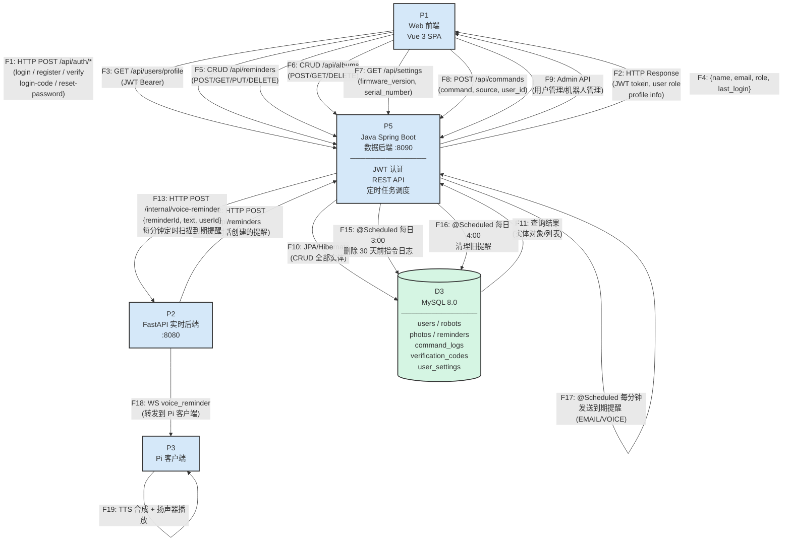

**图 2.3 数据管理层数据流图（DFD Level 1 — 数据层）**

> **说明**：本图聚焦于系统的数据持久化层，展示三条核心路径：
> 1. **认证与用户数据流**（F1↔F2）：Web 前端通过 REST API 与 Java 后端进行登录/注册/验证交互，获取 JWT 令牌
> 2. **业务 CRUD 流**（F3-F9）：提醒、相册、设置、指令日志、管理员操作的 REST 读写路径，所有数据通过 JPA/Hibernate 持久化到 MySQL
> 3. **跨系统协同流**（F12-F19）：Python 后端通过 HTTP 调用 Java 后端的提醒 API（AI 创建提醒）；Java 后端定时扫描到期提醒，通过 `/internal/voice-reminder` 接口回调 Python 后端，最终转发到 Pi 客户端进行 TTS 语音播报

### 3、数据字典

#### 3.1 数据流条目

（1）**用户认证信息**
- 描述：用户登录/注册时提交的身份信息
- 定义：用户认证信息 = 邮箱 + 密码 + 机器人序列号（注册时必填）

（2）**控制指令**
- 描述：Web 端发送给机器人的控制命令
- 定义：控制指令 = 指令类型 + 角度参数
- 指令类型 = [forward | backward | left | right | stop | servo1 | servo2 | speed_low | speed_medium | speed_high | take_photo]

（3）**机器人状态**
- 描述：机器人实时回传的状态信息
- 定义：机器人状态 = 电量百分比 + 信号强度 + 连接状态 + 摄像头帧数据

（4）**AI 对话消息**
- 描述：用户与 AI 助手之间的对话消息
- 定义：AI 对话消息 = 用户ID + 消息内容 + 会话ID + 时间戳 + 动作类型
- 动作类型 = [chat_reply | control_robot | set_reminder]

（5）**提醒信息**
- 描述：用户设置的定时提醒
- 定义：提醒信息 = 提醒ID + 用户ID + 提醒内容 + 预定时间 + 提醒方式 + 邮箱地址 + 启用状态 + 发送状态 + 创建时间
- 提醒方式 = [EMAIL | VOICE]

（6）**照片信息**
- 描述：机器人拍摄的照片记录
- 定义：照片信息 = 照片ID + URL + 文件名 + 拍摄日期 + 所属用户ID

（7）**WebRTC 信令**
- 描述：浏览器与树莓派之间建立 WebRTC 连接的信令数据
- 定义：WebRTC 信令 = 信令类型 + SDP 描述 + ICE 候选
- 信令类型 = [offer | answer | candidate]

#### 3.2 数据项条目

```
用户邮箱 = 5{字母/数字/特殊字符}100 + "@" + 域名
密码 = 8{字母/数字/特殊符号}200  // bcrypt 加密存储
用户名 = 1{中文字符/英文字母}50
角色 = [Admin | User]  // 默认 User
机器人序列号 = 1{字母/数字/连字符}100  // 唯一索引
控制指令 = 1{字母}20
指令来源 = [web | voice | auto]
提醒内容 = 1{任意字符}500
提醒方式 = [EMAIL | VOICE]
邮箱地址 = 1{任意字符}100  // 提醒邮箱
启用状态 = [true | false]
发送状态 = [true | false]
预定时间 = 年-月-日 时:分:秒
创建时间 = 年-月-日 时:分:秒
年 = 4{数字}4
月 = 2{数字}2
日 = 2{数字}2
时 = 2{数字}2
分 = 2{数字}2
秒 = 2{数字}2
照片 URL = 1{任意字符}1000
文件名 = 1{任意字符}255
拍摄日期 = 年-月-日
验证码 = 6{数字}6
验证码类型 = [login | register | reset_password]
固件版本 = 1{数字/小数点}50  // 如 "v2.4.1 (latest)"
令牌 = JWT 编码字符串  // 包含 userId (sub)、email、role、有效期
```

#### 3.3 数据库实体联系图

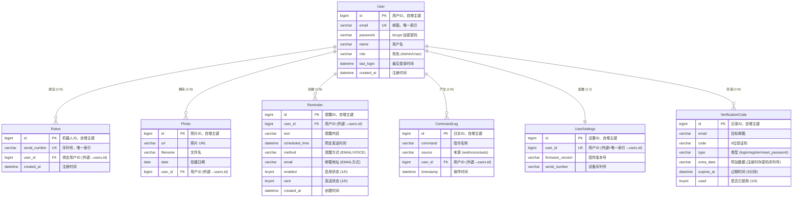

**图 3.1 数据库实体联系图（E-R 图）**

---

## 四、系统设计

### 1、层次图

#### 1.1 系统架构层次图

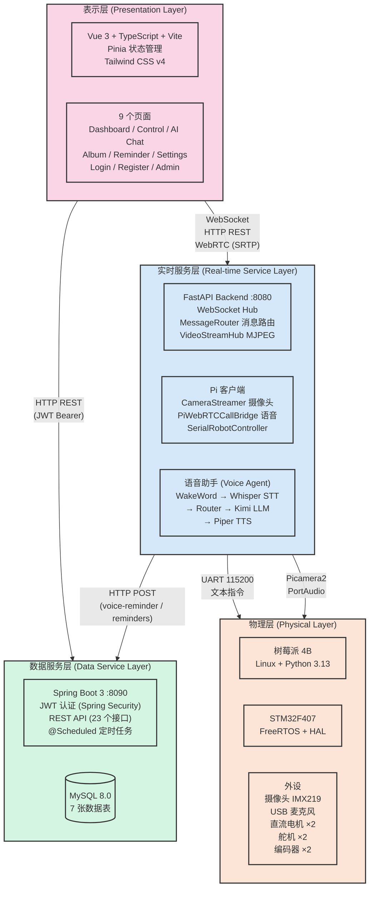

**图 4.1 系统架构层次图**

#### 1.2 系统模块结构图

```mermaid
graph TD
    %% ========== 子系统1: Pi ==========
    subgraph PiSub["Family_Robot_pi (树莓派运行时)"]
        direction TB
        MainPy["main.py<br/>统一启动入口<br/>--mode all|voice|remote"]

        subgraph Backend["backend/"]
            AppPy["app.py<br/>FastAPI 应用<br/>HTTP + WS 端点"]
            Core["core/<br/>ConnectionManager<br/>MessageRouter<br/>RTCService<br/>VideoStreamHub"]
            Front["front/<br/>ws_front.py<br/>AI Chat Handler<br/>Session Manager"]
            PiWS["pi/<br/>ws_pi.py<br/>Camera Frame Handler<br/>Status Handler"]
            Models["models/<br/>Pydantic 模型<br/>Command/Status/WebRTC"]
            Internal["internal/<br/>voice_reminder.py<br/>内部接口"]
        end

        subgraph Brain["brain/"]
            SessionMgr["session_manager.py<br/>AI 会话管理"]
            KimiClient["kimi_client.py<br/>Kimi K2.5 客户端"]
        end

        subgraph Interaction["interaction/"]
            PiClient["pi_client.py<br/>PiWebSocketClient"]
            WebRTC["webrtc_call.py<br/>PiWebRTCCallBridge"]
            Robot["robot/<br/>controller.py (模拟)<br/>serial_controller.py (UART)"]
        end

        subgraph Senses["senses/"]
            Camera["camera_streamer.py<br/>Picamera2 → JPEG → base64"]
        end
    end

    %% ========== 子系统2: Web ==========
    subgraph WebSub["Family_Robot_Web_PC (Web 前端)"]
        direction TB

        subgraph Views["views/ (9 个页面)"]
            Dashboard["Dashboard<br/>控制面板"]
            AIChat["AIChat<br/>AI 对话"]
            Album["Album<br/>相册"]
            ReminderView["Reminder<br/>提醒管理"]
            SettingsView["Settings<br/>设置"]
            LoginRegister["Login / Register<br/>认证"]
            AdminViews["admin/<br/>Users / Robots"]
        end

        subgraph Services["services/"]
            API["api.ts<br/>REST API 封装"]
            WSService["websocket.ts<br/>WebSocket 管理<br/>(心跳+重连)"]
            RTCService["webrtc.ts<br/>WebRTC 语音通话"]
        end

        subgraph Stores["stores/"]
            AuthStore["authStore.ts"]
            ChatStore["chatStore.ts"]
            RobotStore["robotStore.ts"]
        end
    end

    %% ========== 子系统3: Java ==========
    subgraph JavaSub["Family_Robot_Back_PC (Java 数据后端)"]
        direction TB

        subgraph ControllerLayer["controller/"]
            AuthCtrl["AuthController<br/>登录/注册/验证码"]
            UserCtrl["UserController<br/>个人信息"]
            ReminderCtrl["ReminderController<br/>提醒 CRUD"]
            AlbumCtrl["AlbumController<br/>相册管理"]
            CommandCtrl["CommandController<br/>操作日志"]
            SettingsCtrl["SettingsController<br/>设备设置"]
            AdminCtrl["AdminController<br/>用户/机器人管理"]
        end

        subgraph ServiceLayer["service/"]
            AuthSvc["AuthService"]
            ReminderSvc["ReminderService<br/>定时调度 @Scheduled"]
            EmailSvc["EmailService<br/>QQ SMTP"]
            AdminSvc["AdminService"]
        end

        subgraph DataLayer2["repository + model"]
            Repos["7 个 JPA Repository"]
            Entities["entity/ (7 个实体)"]
            DTOs["dto/ (请求/响应 DTO)"]
        end

        Security2["security/<br/>JwtTokenProvider<br/>JwtAuthFilter<br/>AesUtil"]
    end

    %% ========== 子系统4: STM32 ==========
    subgraph STM32Sub["Family_Robot_STM32 (嵌入式固件)"]
        direction TB
        FreeRTOS["FreeRTOS Kernel<br/>任务调度器"]

        subgraph Tasks["Tasks"]
            DefaultTask["defaultTask<br/>编码器速度打印<br/>@500ms"]
            LEDTask["LED_Task<br/>心跳指示灯<br/>1s on / 500ms off"]
        end

        subgraph Timers["Timers"]
            TIM1["TIM1<br/>4ch PWM (100Hz)<br/>2路直流电机"]
            TIM13["TIM13<br/>SW PWM (50Hz)<br/>2路舵机"]
            TIM2_5["TIM2 + TIM5<br/>编码器模式<br/>速度测量"]
            TIM7["TIM7<br/>10ms PID ISR"]
        end

        subgraph Comms["Communication"]
            USART1["USART1 115200<br/>命令协议解析<br/>V1=200 / S1=90"]
        end
    end

    %% ========== 跨系统连接 ==========
    WSService -.->|"WebSocket<br/>JSON"| AppPy
    RTCService -.->|"WebRTC<br/>SRTP 音频"| WebRTC
    API -.->|"REST API<br/>HTTP"| AuthCtrl
    AppPy -->|"内部导入"| Core
    PiClient -->|"回调"| Camera
    PiClient -->|"回调"| Robot
    ReminderSvc -->|"HTTP POST"| Internal
    KimiClient -->|"Function Calling"| PiClient

    classDef pi fill:#d5e8f9,stroke:#333,stroke-width:1px
    classDef web fill:#f9d5e5,stroke:#333,stroke-width:1px
    classDef java fill:#d5f5e3,stroke:#333,stroke-width:1px
    classDef stm32 fill:#fce4d6,stroke:#333,stroke-width:1px

    class PiSub,Backend,Brain,Interaction,Senses pi
    class WebSub,Views,Services,Stores web
    class JavaSub,ControllerLayer,ServiceLayer,DataLayer2,Security2 java
    class STM32Sub,Tasks,Timers,Comms stm32
```

**图 4.2 系统模块结构图**

### 2、数据库设计

#### 2.1 用户信息表（users）

| 列名 | 数据类型 | 长度 | 是否为空 | 默认值 | 备注 |
|------|---------|------|---------|--------|------|
| id | bigint | 20 | 否 | 自增 | 用户ID（主键） |
| email | varchar | 100 | 否 | — | 邮箱（唯一索引） |
| password | varchar | 200 | 否 | — | bcrypt 加密密码 |
| name | varchar | 50 | 否 | — | 用户名 |
| role | varchar | 20 | 否 | "User" | 角色（Admin/User） |
| last_login | datetime | — | 是 | null | 最后登录时间 |
| created_at | datetime | — | 否 | CURRENT_TIMESTAMP | 注册时间 |

#### 2.2 机器人信息表（robots）

| 列名 | 数据类型 | 长度 | 是否为空 | 默认值 | 备注 |
|------|---------|------|---------|--------|------|
| id | bigint | 20 | 否 | 自增 | 机器人ID（主键） |
| serial_number | varchar | 100 | 否 | — | 序列号（唯一索引） |
| user_id | bigint | 20 | 是 | null | 绑定用户ID（外键 → users.id） |
| created_at | datetime | — | 否 | CURRENT_TIMESTAMP | 注册时间 |

#### 2.3 照片信息表（photos）

| 列名 | 数据类型 | 长度 | 是否为空 | 默认值 | 备注 |
|------|---------|------|---------|--------|------|
| id | bigint | 20 | 否 | 自增 | 照片ID（主键） |
| url | varchar | 1000 | 否 | — | 照片 URL |
| filename | varchar | 255 | 是 | null | 文件名 |
| date | date | — | 否 | CURRENT_DATE | 拍摄日期 |
| user_id | bigint | 20 | 是 | null | 用户ID（外键 → users.id） |

#### 2.4 提醒信息表（reminders）

| 列名 | 数据类型 | 长度 | 是否为空 | 默认值 | 备注 |
|------|---------|------|---------|--------|------|
| id | bigint | 20 | 否 | 自增 | 提醒ID（主键） |
| user_id | bigint | 20 | 否 | — | 用户ID（外键 → users.id） |
| text | varchar | 500 | 否 | — | 提醒内容 |
| scheduled_time | datetime | — | 否 | — | 预定发送时间 |
| method | varchar | 10 | 否 | — | 提醒方式（EMAIL/VOICE） |
| email | varchar | 100 | 是 | null | 邮箱地址（EMAIL 方式必填） |
| enabled | tinyint | 1 | 否 | 1 | 启用状态（1启用/0禁用） |
| sent | tinyint | 1 | 否 | 0 | 发送状态（1已发送/0未发送） |
| created_at | datetime | — | 否 | CURRENT_TIMESTAMP | 创建时间 |

#### 2.5 操作日志表（command_logs）

| 列名 | 数据类型 | 长度 | 是否为空 | 默认值 | 备注 |
|------|---------|------|---------|--------|------|
| id | bigint | 20 | 否 | 自增 | 日志ID（主键） |
| command | varchar | 30 | 否 | — | 指令名称 |
| source | varchar | 20 | 是 | null | 来源（web/voice/auto） |
| user_id | bigint | 20 | 是 | null | 用户ID（外键 → users.id） |
| timestamp | datetime | — | 否 | CURRENT_TIMESTAMP | 操作时间 |

#### 2.6 验证码表（verification_codes）

| 列名 | 数据类型 | 长度 | 是否为空 | 默认值 | 备注 |
|------|---------|------|---------|--------|------|
| id | bigint | 20 | 否 | 自增 | 记录ID（主键） |
| email | varchar | 100 | 否 | — | 目标邮箱 |
| code | varchar | 6 | 否 | — | 6位验证码 |
| type | varchar | 20 | 否 | — | 类型（login/register/reset_password） |
| extra_data | varchar | 200 | 是 | null | 附加数据（注册时存储密码和序列号） |
| expires_at | datetime | — | 否 | — | 过期时间（创建后5分钟） |
| used | tinyint | 1 | 否 | 0 | 是否已使用 |

#### 2.7 用户设置表（user_settings）

| 列名 | 数据类型 | 长度 | 是否为空 | 默认值 | 备注 |
|------|---------|------|---------|--------|------|
| id | bigint | 20 | 否 | 自增 | 设置ID（主键） |
| user_id | bigint | 20 | 否 | — | 用户ID（外键、唯一索引 → users.id） |
| firmware_version | varchar | 50 | 否 | "v2.4.1 (latest)" | 固件版本号 |
| serial_number | varchar | 50 | 否 | "RBT-00001" | 设备序列号 |

---

## 五、核心功能实现

### 1、实时通信模块（WebSocket）

系统基于 WebSocket 建立了 Web 端与 Pi 端的实时双向通信通道。Python Backend 作为消息中继，维护一个 Web 端连接和一个 Pi 端连接，根据消息类型进行路由转发。

**关键实现**：
- `ConnectionManager` 同时管理 web 和 pi 两个连接实例
- 注册机制：客户端连接后需在 30 秒内发送 `{ type: "register", role: "web"|"robot" }` 完成角色注册
- 消息路由：`MessageRouter` 根据消息 type 字段分发到对应的 handler（`ws_front` / `ws_pi`）
- 前端心跳：每 30 秒发送 `{ type: "heartbeat" }` 保持连接
- 自动重连：断连后最多重试 5 次，间隔 1.5 秒

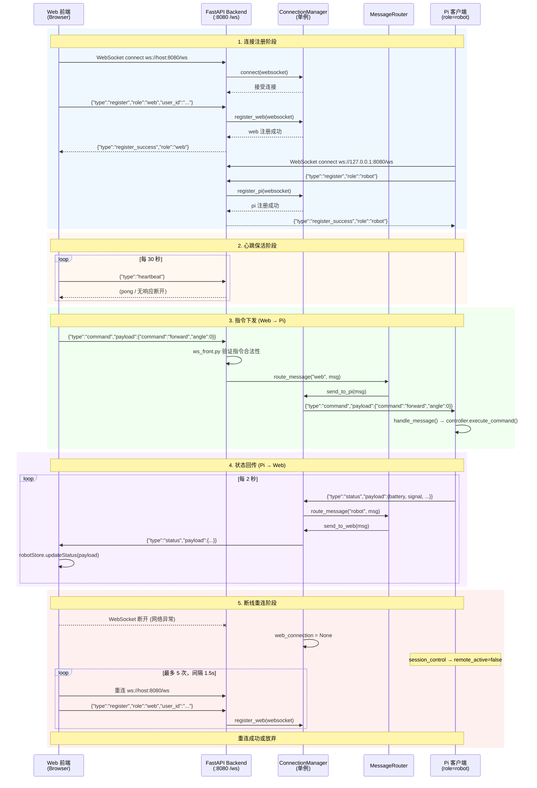

**图 5.1 WebSocket 通信时序图**

### 2、AI 智能对话模块

AI 对话模块实现了意图识别增强方案（A+B 组合），确保用户指令被准确理解和执行。

**核心流程**：
1. 用户通过 WebSocket 发送 `ai_chat` 消息（含 user_id、message、email）
2. **Scheme A — 预过滤**：`_prefilter_command()` 使用正则匹配检测清晰的运动/停止/舵机指令，命中则直接执行，跳过 AI 调用
3. **Scheme B — 强制 tool_choice**：`_detect_tool_choice()` 基于关键词检测（移动类/提醒类）设置 tool_choice，Kim K2.5 被强制调用指定工具
4. AI 返回 tool_call 后，`_execute_tool_call()` 执行相应操作（控制机器人/设置提醒/文字回复）
5. 多轮对话上下文由 `session_manager` 维护，每用户最多 50 轮

```mermaid
flowchart TD
    Start(["用户发送 ai_chat 消息<br/>{user_id, message, email}"])
    Session["session_manager.get_or_create(user_id)<br/>获取/创建会话上下文<br/>(最多 50 轮对话记录)"]

    %% Scheme A: 预过滤
    Prefilter{"Scheme A: _prefilter_command()<br/>正则匹配检测<br/>清晰运动/停止/舵机指令？"}
    DirectExec["直接执行控制指令<br/>manager.send_to_pi(command)<br/>跳过 AI 调用<br/>延迟 ≤ 50ms"]
    DirectReply["返回 chat_reply<br/>告知用户已执行"]
    PrefilterEnd(["结束"])

    %% Scheme B: 关键词检测
    ToolDetect{"Scheme B: _detect_tool_choice()<br/>关键词检测<br/>(移动类/提醒类关键词)？"}
    NoTool["tool_choice = 'auto'<br/>让 AI 自行决策"]
    ForceTool["强制 tool_choice<br/>control_robot 或 set_reminder"]

    %% AI 调用
    CallKimi["调用 Kimi K2.5 API<br/>kimi_client.chat()<br/>传入: system prompt<br/>+ 对话历史 + tools 定义"]
    KimiResponse{"AI 返回类型？"}

    %% 工具执行
    ToolCall["tool_call 返回"]
    ExecControl["_execute_control_robot()<br/>manager.send_to_pi(command)<br/>→ WebSocket → Pi → STM32"]
    ExecReminder["_execute_set_reminder()<br/>HTTP POST → Java Backend<br/>→ /api/reminders"]
    ExecReply["chat_reply<br/>文字回复用户"]

    TextReply["plain text 返回<br/>直接作为 chat_reply"]

    StoreHistory["session_manager.add_message()<br/>存储本轮对话记录"]
    SendToUser(["通过 WebSocket<br/>发送 chat_reply 给用户"])

    Error["AI 调用异常？<br/>返回错误提示"]

    %% 连线
    Start --> Session
    Session --> Prefilter

    Prefilter -- "是 (匹配成功)" --> DirectExec
    DirectExec --> DirectReply
    DirectReply --> PrefilterEnd

    Prefilter -- "否 (未匹配)" --> ToolDetect

    ToolDetect -- "检测到移动类关键词<br/>(前进/后退/左转/右转/停下/移动)" --> ForceTool
    ToolDetect -- "检测到提醒类关键词<br/>(提醒/定时/通知/稍后)" --> ForceTool
    ToolDetect -- "无关键词匹配" --> NoTool

    NoTool --> CallKimi
    ForceTool --> CallKimi

    CallKimi --> KimiResponse
    KimiResponse -- "tool_call" --> ToolCall
    KimiResponse -- "plain text" --> TextReply
    KimiResponse -- "异常/超时" --> Error

    ToolCall --> ExecControl
    ToolCall --> ExecReminder
    ToolCall --> ExecReply

    ExecControl --> StoreHistory
    ExecReminder --> StoreHistory
    ExecReply --> StoreHistory
    TextReply --> StoreHistory
    Error --> StoreHistory

    StoreHistory --> SendToUser

    classDef start fill:#d5e8f9,stroke:#333,stroke-width:2px
    classDef decision fill:#fce4d6,stroke:#333,stroke-width:2px
    classDef action fill:#d5f5e3,stroke:#333,stroke-width:2px
    classDef end fill:#f9d5e5,stroke:#333,stroke-width:2px

    class Start,Session start
    class Prefilter,ToolDetect,KimiResponse decision
    class DirectExec,ForceTool,NoTool,CallKimi,ExecControl,ExecReminder,ExecReply,TextReply,StoreHistory,Error action
    class PrefilterEnd,SendToUser,DirectReply end
```

**图 5.2 AI 对话处理流程图**

### 3、提醒服务模块

提醒服务支持邮件和语音两种方式，由 Java 后端定时调度触发。

**架构**：
- 创建：Web 端手动创建 或 Python 端 AI 通过 REST API 创建
- VOICE 中文预翻译：中文语音提醒在创建时由 Kimi 翻译为英文，避免触发时的翻译延迟
- 调度：`@Scheduled(cron = "0 * * * * *")` 每秒扫描到期提醒
- 邮件发送：Java EmailService → QQ SMTP 服务器
- 语音播报：Java ReminderService → `POST /internal/voice-reminder` → Python → WebSocket → Pi TTS 播报
- 过期清理：每天凌晨 4:00 清理 30 天前的旧提醒

```mermaid
flowchart LR
    %% ==================== 创建来源 ====================
    subgraph 创建来源["提醒创建来源"]
        Manual["Web 手动创建<br/>POST /api/reminders"]
        AICreate["AI 对话创建<br/>Kimi tool_call →<br/>HTTP POST /api/reminders"]
    end

    %% ==================== Java 后端处理 ====================
    subgraph JavaProcessing["Java Spring Boot 处理"]
        ReminderSvc["ReminderService<br/>save(reminder)"]
        Translate{"VOICE 方式<br/>且中文内容？"}
        KimiTrans["调用 Kimi K2.5<br/>翻译为英文<br/>(避免触发时延迟)"]
        SaveDB["保存到 MySQL<br/>reminders 表"]

        Scheduler["@Scheduled(cron='0 * * * * *')<br/>每分钟扫描到期提醒"]
        CheckSent{"sent=false<br/>AND scheduled_time ≤ now？"}
        MethodCheck{"提醒方式？"}
    end

    %% ==================== 发送通道 ====================
    subgraph Delivery["发送通道"]
        EmailSend["EmailService<br/>QQ SMTP 发送<br/>→ 用户邮箱"]
        VoiceHTTP["HTTP POST<br/>/internal/voice-reminder<br/>{reminderId, text, userId}"]
    end

    %% ==================== Python 处理 ====================
    subgraph PythonDelivery["Python 语音播报"]
        VoiceHandler["voice_reminder.py<br/>handle_voice_reminder()"]
        WSSend["ConnectionManager<br/>send_to_pi(voice_reminder)"]
        PiReceive["Pi 客户端接收<br/>→ voice_reminder_handler"]
        TTS["Orchestrator<br/>PiperTTS.synthesize()<br/>→ AudioManager.play_wav()"]
    end

    subgraph Cleanup["定时清理"]
        DailyClean["@Scheduled(cron='0 0 4 * * *')<br/>每日 4:00 清理旧提醒"]
    end

    %% ==================== 数据流连线 ====================
    Manual --> ReminderSvc
    AICreate --> ReminderSvc
    ReminderSvc --> Translate
    Translate -- "是" --> KimiTrans --> SaveDB
    Translate -- "否" --> SaveDB
    SaveDB --> Scheduler
    Scheduler --> CheckSent
    CheckSent -- "否 (无到期提醒)" --> Scheduler
    CheckSent -- "是" --> MethodCheck
    MethodCheck -- "EMAIL" --> EmailSend
    MethodCheck -- "VOICE" --> VoiceHTTP
    VoiceHTTP --> VoiceHandler
    VoiceHandler --> WSSend
    WSSend --> PiReceive
    PiReceive --> TTS
    EmailSend --> |"更新 sent=true"| SaveDB
    TTS --> |"更新 sent=true"| SaveDB
    SaveDB --> DailyClean

    classDef create fill:#d5e8f9,stroke:#333,stroke-width:1px
    classDef java fill:#d5f5e3,stroke:#333,stroke-width:1px
    classDef deliver fill:#fce4d6,stroke:#333,stroke-width:1px
    classDef python fill:#f9d5e5,stroke:#333,stroke-width:1px

    class Manual,AICreate create
    class ReminderSvc,Translate,KimiTrans,SaveDB,Scheduler,CheckSent,MethodCheck java
    class EmailSend,VoiceHTTP deliver
    class VoiceHandler,WSSend,PiReceive,TTS python
```

**图 5.3 提醒服务架构图**

### 4、视频流与 WebRTC 模块

**MJPEG 视频流**：
- Pi 端使用 Picamera2 持续采集 JPEG 帧
- 通过 WebSocket 发送 base64 编码的帧数据到 Python Backend
- Backend 的 `VideoStreamHub` 维护最新一帧（内存缓存）
- 浏览器请求 `/video/stream` 时返回 `multipart/x-mixed-replace` 流式响应
- 每次有新的帧到达时写入响应流，实现近乎实时的视频传输

**WebRTC 语音通话**：
- 前端 `WebRTCService` 创建 RTCPeerConnection（仅音频），生成 SDP offer
- SDP offer/answer 和 ICE candidate 通过 WebSocket 信令通道中继
- Pi 端 `aiortc` 应答并建立 P2P 连接
- 音频轨道从前端麦克风传输到 Pi 端播放

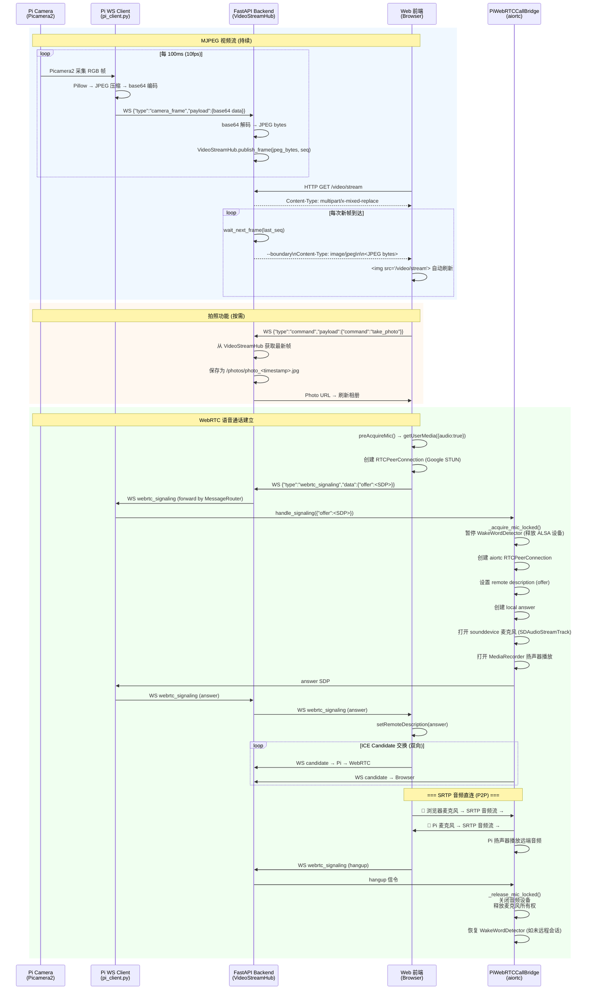

**图 5.4 视频流与 WebRTC 传输架构图**

### 5、电机与舵机控制模块（STM32 固件）

STM32F407 运行 FreeRTOS，通过 TIM 定时器实现 PWM 驱动：

- **TIM1**：4 通道 PWM（100Hz）驱动 2 路直流电机 H 桥 → 控制机器人移动
- **TIM13**：软件 PWM（50Hz，10μs ISR）驱动 2 路舵机 → 控制摄像头云台
- **TIM2/TIM5**：编码器模式（Period=60000）→ 速度测量
- **TIM7**：10ms 定时器 → 速度计算周期
- **USART1**：115200 波特率，接收命令协议 `S1=90`（舵机1角度）、`M1=500`（电机1速度±1000）

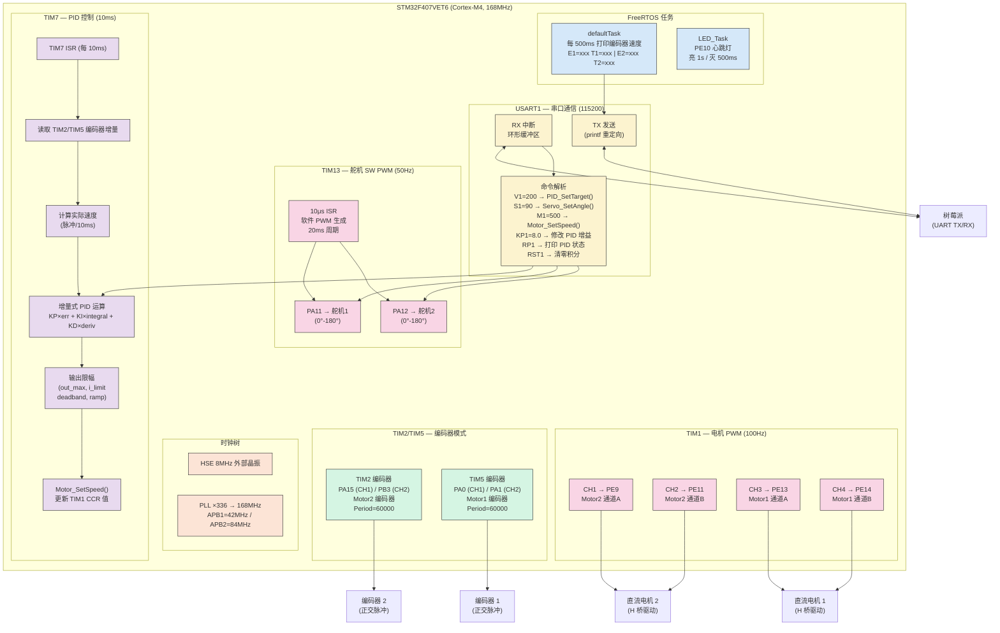

**图 5.5 STM32 硬件驱动框图**

---

## 六、系统部署与运行

### 1、系统部署架构

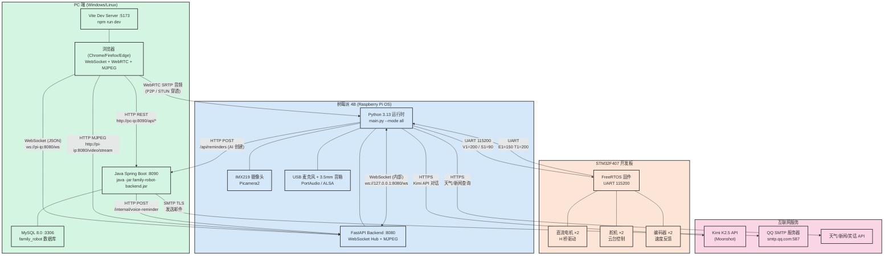

**图 6.1 系统部署架构图**

### 2、启动流程

**树莓派端**（统一启动）：
```bash
cd Family_Robot_pi
source venv313/bin/activate
python main.py --mode all    # 同时启动 backend + voice + remote
```

**PC 端 Java 后端**：
```bash
cd Family_Robot_Back_PC
mvn spring-boot:run
# 或 java -jar target/family-robot-backend-1.0.0.jar
```

**PC 端 Web 前端**：
```bash
cd Family_Robot_Web_PC
npm run dev
```

**浏览器访问**：`http://<pi-ip>:5173`（开发模式）

### 3、环境变量配置

| 变量名 | 所属系统 | 说明 | 示例值 |
|--------|---------|------|--------|
| MOONSHOT_API_KEY | Python（Pi） | Kimi K2.5 API 密钥 | `sk-xxxx` |
| JAVA_BACKEND_URL | Python（Pi） | Java 后端地址 | `http://192.168.1.100:8090` |
| SMTP_USERNAME | Java（PC） | QQ 邮箱地址 | `xxxxxx@qq.com` |
| SMTP_PASSWORD | Java（PC） | QQ 邮箱授权码 | `xxxxxxxxxxxx` |
| SERVER_PORT | Java（PC） | Java 服务端口 | `8090` |
| VITE_BACKEND_HTTP_URL | Web（PC） | Python 后端地址 | `http://192.168.1.xxx:8080` |
| VITE_JAVA_API_URL | Web（PC） | Java 后端地址 | `http://localhost:8090` |

---

## 七、总结与展望

### 1、项目总结

本项目成功构建了一套从底层硬件（STM32 电机驱动）到中层服务（Python 实时运行时 + Java 数据管理）再到上层应用（Vue 3 Web 控制面板）的完整家庭服务机器人系统。

**主要成果**：
- 实现了完整的四子系统协同架构，技术栈覆盖嵌入式 C、Python、Java、TypeScript
- 集成了大语言模型（Kimi K2.5）的 function calling 能力，实现了"说话即操控"的自然交互
- 采用 WebSocket + WebRTC + MJPEG 三种实时通信协议，保证了控制的即时性和监控的实时性
- 实现了完整的用户认证体系（JWT + 验证码）、提醒服务和相册管理功能
- 通过 A+B 意图识别增强方案，显著提升了 AI 对操控类指令的识别准确率和响应速度

### 2、后续改进方向

（1）**硬件升级**：将模拟的 RobotController 替换为真实的 STM32 UART 通信，实现完整的硬件闭环；
（2）**视频增强**：采用 WebRTC 视频通道替代 MJPEG，进一步降低视频延迟并支持双向视频；
（3）**自主导航**：集成 SLAM 算法和激光雷达/深度相机，实现环境建图与自主导航；
（4）**智能家居联动**：对接 HomeAssistant 平台，实现机器人与智能家居设备的场景联动；
（5）**移动端适配**：开发 React Native / Uniapp 移动端应用，支持手机远程操控；
（6）**多机器人协同**：扩展 WebSocket 协议支持多机器人管理，实现多机协同任务分配。

---

## 附录

### A. 项目目录结构

```
graduation_project/
├── Family_Robot_pi/              # 树莓派统一运行时（Python）
│   ├── main.py                   # 统一启动入口
│   ├── backend/                  # FastAPI 后端
│   │   ├── app.py                # HTTP + WebSocket 应用
│   │   ├── core/                 # 连接管理、消息路由、WebRTC、视频流
│   │   ├── front/                # Web 端消息处理（含 AI Chat）
│   │   ├── pi/                   # Pi 端消息处理
│   │   ├── models/               # Pydantic 模型
│   │   └── internal/             # 内部接口（语音提醒）
│   ├── brain/                    # AI 会话管理 & Kimi 客户端
│   ├── interaction/              # Pi 客户端、WebRTC、机器人控制
│   └── senses/                   # 摄像头采集
├── Family_Robot_Web_PC/          # Web 前端（Vue 3 + TypeScript）
│   └── src/
│       ├── views/                # 9 个页面 + admin 子目录
│       ├── services/             # API、WebSocket、WebRTC
│       ├── stores/               # Auth、Chat、Robot 状态管理
│       ├── components/           # SideNav、StatusBar、VideoStream
│       ├── layouts/              # MainLayout、AdminLayout
│       ├── router/               # 路由配置（含导航守卫）
│       └── types/                # TypeScript 类型定义
├── Family_Robot_Back_PC/         # Java 数据后端（Spring Boot 3）
│   └── src/main/java/com/familyrobot/
│       ├── controller/           # 7 个 REST 控制器
│       ├── service/              # 业务逻辑层
│       ├── repository/           # JPA 数据访问层
│       ├── model/
│       │   ├── entity/           # 7 个 JPA 实体
│       │   └── dto/              # 数据传输对象
│       └── security/             # JWT 认证与授权
└── Family_Robot_STM32/           # STM32 嵌入式固件（C + FreeRTOS）
    └── FreeRTOS/Src/main.c       # 固件主程序
```

### B. API 接口清单

| 模块 | 方法 | 路径 | 认证 | 说明 |
|------|------|------|------|------|
| Auth | POST | `/api/auth/login` | 无 | 密码登录 |
| Auth | POST | `/api/auth/register` | 无 | 注册（发送验证码） |
| Auth | POST | `/api/auth/verify` | 无 | 验证注册 |
| Auth | POST | `/api/auth/login-code/send` | 无 | 发送登录验证码 |
| Auth | POST | `/api/auth/login-code/verify` | 无 | 验证码登录 |
| Auth | POST | `/api/auth/reset-password/send` | 无 | 发送重置密码验证码 |
| Auth | POST | `/api/auth/reset-password/verify` | 无 | 重置密码 |
| User | GET | `/api/users/profile` | JWT | 获取个人信息 |
| Album | GET | `/api/albums` | JWT | 获取相册 |
| Album | POST | `/api/albums` | JWT | 添加照片 |
| Album | DELETE | `/api/albums/{id}` | JWT | 删除照片 |
| Settings | GET | `/api/settings` | JWT | 获取设备设置 |
| Command | POST | `/api/commands` | JWT | 记录操作指令 |
| Reminder | GET | `/api/reminders` | 无 | 获取提醒列表 |
| Reminder | POST | `/api/reminders` | 无 | 创建提醒 |
| Reminder | PUT | `/api/reminders/{id}` | JWT | 更新提醒 |
| Reminder | DELETE | `/api/reminders/{id}` | JWT | 删除提醒 |
| Admin | GET | `/api/admin/users` | JWT+Admin | 用户列表 |
| Admin | GET | `/api/admin/users/{id}/password` | JWT+Admin | 查看用户密码 |
| Admin | DELETE | `/api/admin/users/{id}` | JWT+Admin | 删除用户（级联） |
| Admin | GET | `/api/admin/robots` | JWT+Admin | 机器人列表 |
| Admin | POST | `/api/admin/robots` | JWT+Admin | 注册机器人 |
| Admin | DELETE | `/api/admin/robots/{id}` | JWT+Admin | 删除机器人 |
| Python | GET | `/` | 无 | 健康检查 |
| Python | GET | `/video/stream` | 无 | MJPEG 视频流 |
| Python | GET | `/api/photos` | 无 | 照片列表 |
| Python | GET | `/photos/{filename}` | 无 | 静态照片文件 |
| Python | WS | `/ws` | 无 | WebSocket 通信 |
| Python | POST | `/internal/voice-reminder` | 内部 | 语音提醒触发 |

---

*文档版本：v1.1*
*最后更新：2026-05-21*
*更新内容：补全全部 11 幅 Mermaid 图表（DFD / E-R / 架构 / 模块 / 时序 / 流程图）*
